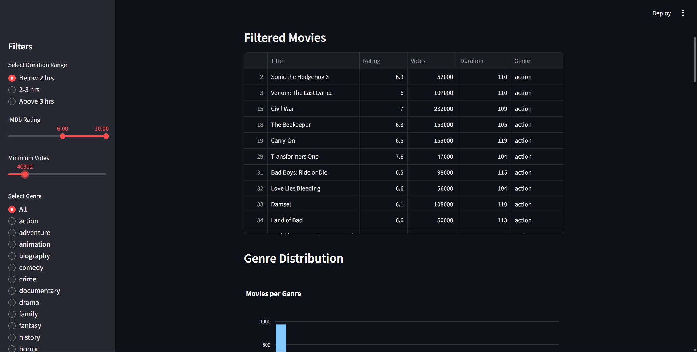
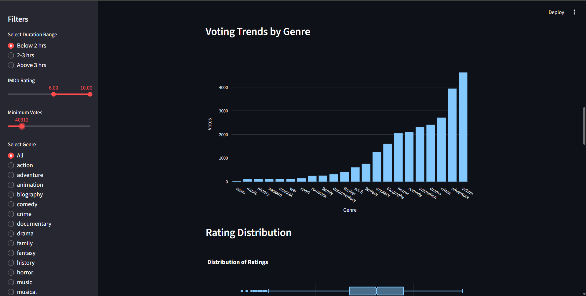

# 🎬 IMDb 2024 Movie Data Analysis Project

## 📌 Overview

This project focuses on extracting, processing, and analyzing movie data from IMDb for the year **2024**. Using web scraping techniques with Selenium, the project collects key movie attributes such as titles, genres, ratings, voting counts, and durations.

The collected data is then structured, stored, and visualized through an interactive Streamlit application, enabling users to explore insights and trends in the 2024 movie landscape.

---

## 🚀 Project Workflow

### 1. Data Extraction (Web Scraping)

* Scraped IMDb 2024 movie listings using **Selenium**
* Extracted:

  * Movie Title
  * Genre
  * IMDb Rating
  * Voting Count
  * Duration

---

### 2. Data Processing

* Cleaned and formatted raw scraped data
* Converted duration into minutes
* Handled missing/null values
* Split and categorized movies based on genres

---

### 3. Data Storage

* Saved **genre-wise datasets** as individual CSV files
* Combined all datasets into a **single master dataset**
* Stored final dataset in an **SQL database** for efficient querying

---

### 4. Data Visualization (Streamlit App)

* Built an interactive dashboard using **Streamlit**
* Enabled filtering and dynamic exploration of movie data

---
## 📊 Dashboard Preview




## 📊 Key Business Use Cases

### ⭐ Top-Rated Movies

* Identify top 10 movies based on:

  * Highest ratings
  * High voting counts (ensures credibility)

---

### 🎭 Genre Analysis

* Analyze distribution of movies across genres
* Identify dominant genres in 2024

---

### ⏱️ Duration Insights

* Calculate average movie duration per genre
* Understand trends in movie lengths

---

### 🗳️ Voting Patterns

* Identify genres with highest average voting counts
* Understand audience engagement by genre

---

### 📈 Popular Genres

* Determine most common genres based on movie count

---

### 📉 Rating Distribution

* Visualize how ratings are distributed across all movies
* Identify clustering (e.g., most movies between 6–8 rating)

---

### 🎯 Genre vs Ratings

* Compare average ratings across genres
* Identify high-performing genres

---

### ⏳ Duration Extremes

* Find:

  * Shortest movie
  * Longest movie

---

### 🔝 Top-Voted Movies

* Identify top 10 movies with highest vote counts

---

### 🎛️ Interactive Filtering

Users can dynamically filter movies based on:

* Rating range
* Duration range
* Voting count
* Genre

Filtered results are displayed in an interactive table.

---

## 🛠️ Tech Stack

| Component       | Technology Used   |
| --------------- | ----------------- |
| Web Scraping    | Selenium (Python) |
| Data Processing | Pandas, NumPy     |
| Database        | MySQL / SQL       |
| Visualization   | Streamlit, Plotly |
| Storage         | CSV Files         |

---

## 📂 Project Structure

```
IMDb_2024_Project/
│
├── data/
│   ├── genre_wise_csv/
│   ├── combined_data.csv
│
├── database/
│   ├── imdb_movies.sql
│
├── scraping/
│   ├── imdb_scraper.py
│
├── processing/
│   ├── data_cleaning.py
│
├── app/
│   ├── streamlit_app.py
│
├── models/ (optional)
│
└── README.md
```

---

## ▶️ How to Run the Project

### 1. Clone Repository

```bash
git clone <your-repo-link>
cd IMDb_2024_Project
```

### 2. Install Dependencies

```bash
pip install -r requirements.txt
```

### 3. Run Scraper

```bash
python imdb_scraper.py
```

### 4. Process Data

```bash
python data_cleaning.py
```

### 5. Run Streamlit App

```bash
streamlit run streamlit_app.py
```

---

## 📌 Features

* Automated IMDb data scraping
* Clean and structured dataset
* SQL database integration
* Interactive dashboard with filters
* Insightful visualizations using Plotly
* Genre-based analysis

---

## 📈 Future Enhancements

* Add machine learning for movie success prediction
* Integrate real-time IMDb updates
* Deploy Streamlit app to cloud (Streamlit Cloud / Hugging Face)
* Add recommendation system based on user preferences

---

## 👤 Author

**Arjun**
BSc Data Science Student
Passionate about Data Analytics, Machine Learning, and Building Real-World Projects

---

## 📜 License

This project is for educational purposes only. IMDb data is publicly accessible but subject to their terms of use.

---

✨ *Explore the trends of cinema in 2024 with data-driven insights!*
